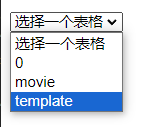
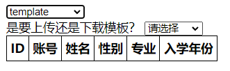
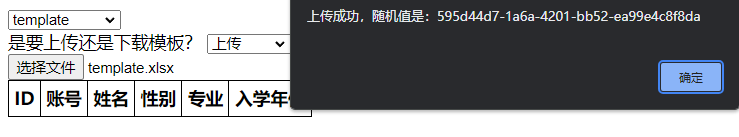
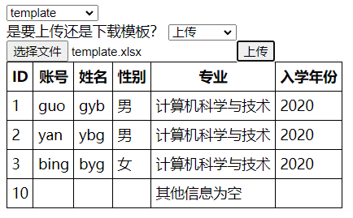

# 数据库表格管理系统

该项目是一个基于 Koa 框架的数据库表格管理系统，允许用户下载模板、修改后上传至数据库，并提供了一系列接口用于查询、上传和下载表格数据。

## 功能特性

- 初始化数据库： 从多个 Excel 文件中读取数据并自动创建相应的数据库表格。

- 查询数据库： 提供接口获取数据库中所有表格的名称以及指定表格的列名和数据。

- 选择表格： 用户可以在前端选择要操作的表格，选择后前端表格立即刷新。



- 下载模板： 用户可以下载所选定表格的模板文件。


- 上传文件： 用户可以通过上传 Excel 文件将数据导入数据库中。上传的文件的文件名不需要和表名相同，因为判断标准是文件表头是否和数据库中的表的表头一致。ID 为数据库主键，不可重复，若上传的文件中含有重复的 ID，则会更新该行数据而不是插入。上传成功后前端表格立即刷新。



## 项目结构

项目的主要结构如下：

- web 目录： 包含前端文件，通过 Koa 静态文件服务提供给用户。
- data 目录： 包含 Excel 模板文件，用于初始化数据库和提供给用户下载。
- src 目录： 包含后端代码，主要使用 Koa、Router、MySQL2 和 XLSX 等库。
- images 目录： 包含 README.md 中的图片。

## 安装和运行

1. 安装依赖：npm install

2. 添加环境变量：在项目根目录下创建 .env 文件，内容如下：

```bash
DB_HOST=
DB_PORT=
DB_USER=
DB_PASSWORD=
DB_NAME=
```

3. 运行项目：npm start

默认通过 http://localhost:3000 来访问系统。

## 接口文档

| 序号 | 接口名称 | 请求方法 | 请求参数 | 返回格式 | 返回字段 |
|-|-|-|-|-|-|
| 1 | 获取所有表格的名称。 | GET | 无 | JSON | tables，包含所有表格的名称。 |
| 2 | 获取指定表格的列名和数据。 | GET | table：指定表格的名称。 | JSON | headers：指定表格的列名；data：指定表格的数据。 |
| 3 | 上传文件到数据库。 | POST | file，上传的 Excel 文件；table，指定上传到哪个表格。 | JSON | success，上传是否成功；message，成功或失败的消息；randomValue，文件 ID，随机值。 |
| 4 | 下载表格模板。 | GET | table，指定下载哪个表格的数据。 | Excel | 文件。 |

## Tips

已尽可能的考虑到各种异常情况，例如表名为数字、表头中不含 `ID` 或只有 `ID`、列名为关键字、某一列列名为空、单元格内容填写为"undefined"或"NULL"（此时不能识别为空）、上传的文件不是 Excel 文件等等，但仍然可能存在一些未考虑到的情况。

## TODO

- [x] 将数据库的连接信息放在配置文件中。
- [ ] 将SQL语句放在配置文件中。
- [ ] 上传的 Excel 文件中包含多个表格。
- [ ] 将后端返回的错误信息在前端更完善地反馈给用户。
